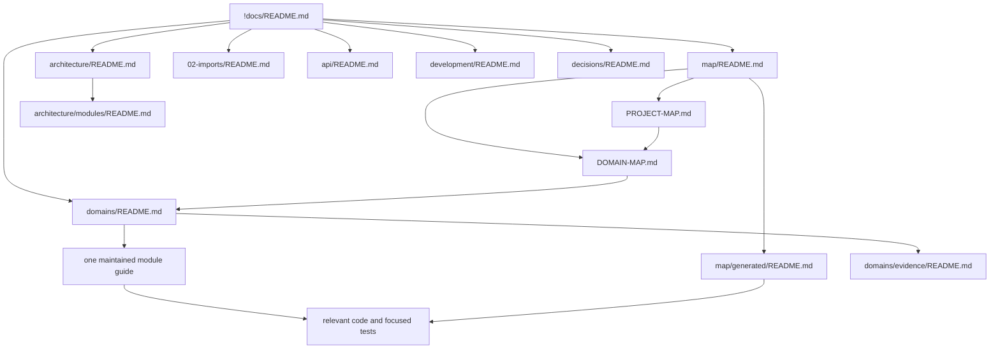

# Finance App documentation

This directory describes the repository as implemented, not only its target
architecture. Product intent and the planned milestones remain in
[`!planning`](../!planning/README.md).

## Current implementation snapshot

The application is in the internal `0.1` architecture milestone. Python owns
the identity, account, transaction, category, budget, operational dashboard,
import, manual investment command, symbol-detail, canonical ledger, Holdings,
market evidence, snapshot, daily-baseline, current-value, portfolio,
dashboard-snapshot, and history workflows. Active manual investment and symbol
detail browser paths are thin adapters over Python. PostgreSQL is the finance
persistence authority, SQLAlchemy is its runtime mapping, and Alembic owns all
executable schema migrations. Prisma runtime and its schema/generator are absent;
only the immutable historical SQL migration archive remains.

The strict current-value engine is implemented as a D1 daily baseline plus
forward canonical changes and current persisted market evidence. R10-E1 closes
the authentication lookup transaction before D1/D2 takes ownership. R10-E2
canonicalizes every public MONEY value to the exact six-decimal wire contract
without changing financial arithmetic. Real authenticated mixed-currency
portfolio and dashboard responses now pass the strict browser validator.

The Python core, runtime cutover, enforceable boundary, and final R10/R11
regression audit are complete. R12 adds crash-safe asynchronous import,
multi-currency cost evidence, a PostgreSQL-backed worker lifecycle, and atomic
portfolio publication. Import publication uses durable per-current-member
minute targets and exact member anchors; incomplete work remains hidden at the
last complete baseline. Its executable scope is limited to R12-A through R12-F.
This status is not a declaration of public-production readiness.

## Reading guide

- [Project Map](map/PROJECT-MAP.md) → [Domain Map](map/DOMAIN-MAP.md) →
  [domain guide](domains/README.md) is the default L0/L1/L2 path.
- [Architecture](architecture/README.md) explains runtime boundaries, data flow,
  security, and cross-domain module evidence.
- [Imports](02-imports/README.md) explains the implemented import pipeline and
  parser boundary.
- [API](api/README.md) routes to the HTTP contract, OpenAPI inventory, and
  adapter boundary.
- [Development](development/README.md) covers setup, testing, coding rules, and
  documentation automation.
- [Decisions](decisions/README.md) indexes implemented decisions; proposed
  long-lived ADRs are in [planning decisions](../!planning/decisions/README.md).
- [Glossary](glossary.md) and [generated inventories](map/generated/README.md)
  provide vocabulary and deterministic file-level discovery.

## Documentation network

When documentation conflicts with code, treat the code, its tests, and the live
OpenAPI document as the immediate runtime truth; update this directory in the
same change that resolves the discrepancy.
