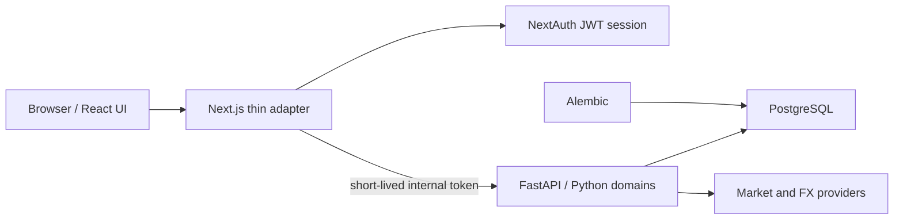

# Epic: Dokonceni Python backendu a odstraneni legacy business kodu

Status: navrzeno

Execution status: in progress; exact commit-sized sequence is maintained in
`../../ChatGPT/steps/0.1-r11.md`.

Priorita: blokuje dalsi produktove rozsireni po `0.1`

Charakter: XL epic rozdeleny na male, samostatne overitelne kroky

## Vysledek a hranice

Cilem je dokoncit hranici, ktera byla pozadovana pro verzi `0.1`:

- Python/FastAPI je jediny vlastnik business pravidel, autorizace nad financnimi daty,
  databazovych operaci, importu, ledgeru, vypoctu, trznich dat a snapshotu.
- PostgreSQL schema a migrace vlastni pouze SQLAlchemy/Alembic.
- TypeScript/Next.js vlastni uzivatelske rozhrani, prezentacni stav, NextAuth session a
  tenke same-origin API adaptery.
- Browser nikdy nezna interni Python token ani backend URL a nevola FastAPI primo.
- Legacy TypeScript/Prisma business kod se po overenem cutoveru odstrani, ne pouze odpoji.

Epic pokryva dokonceni dnes existujicich funkci aplikace. Nepridava nove produktove
funkce z `0.2+`, mobilni aplikaci, verejne API ani novy analyticky engine.

Orientační pracnost pro jednoho vyvojare je priblizne 25-40 cistych vyvojovych dni
vcetne migraci, integracnich testu a odstraneni starych cest. Prace se ma vydavat po
vertikalnich rezech; nema vzniknout jeden nevratny big-bang prepis.

## Proc je epic nutny

Zakladni Python workflow uz existuji, ale runtime hranice jeste neni dokoncena:

- dashboard soucasne vola Python snapshot a legacy `/api/dashboard`;
- legacy dashboard cte financni data pres Prisma a muze zapisovat Yahoo FX;
- transakce, kategorie a rozpocty jsou stale plne v TypeScriptu/Prisma;
- rucni investicni udalosti stale spousti TS ledger, prepocet holdings a TS snapshot;
- cast sdileni uctu a prihlaseni pristupuje k databazi primo z Next.js;
- TS importni parsery, ledger, rates a snapshot service zustavaji v repozitari;
- Alembic je aktualni vlastnik schematu, ale Prisma stale funguje jako runtime
  compatibility mirror.

Proto nelze povazovat hranici „Python je source of truth“ za uplne uzavrenou, dokud
neprojde zaverecny audit tohoto epicu.

## Cilova architektura

Next.js adapter smi provest pouze:

1. nacteni a kontrolu session;
2. syntakticke parsovani a allowlist vstupu;
3. vytvoreni kratkodobeho interniho tokenu;
4. jeden nebo nekolik explicitne orkestrovanych Python API pozadavku bez domenoveho
   rozhodovani;
5. mapovani bezpecneho API vysledku nebo chyby do browser odpovedi.

Next.js adapter nesmi cist ani zapisovat financni tabulky, volat datove providery,
vybirat kurz/cenu, pocitat zustatek, PnL, budget progress, holdings nebo snapshot.

## Co zustane v TypeScriptu

| Oblast          | Povoleno                                                                  | Nepovoleno                                                             |
| --------------- | ------------------------------------------------------------------------- | ---------------------------------------------------------------------- |
| UI              | React komponenty, formulare, tabulky, grafy, loading/error stavy          | financni source of truth nebo trvale domenove rozhodnuti               |
| Prezentace      | format data, meny a procent, lokalni filtrovani jiz nacteneho view modelu | prepocet hodnot portfolia, FX, PnL, budgetu nebo holdings              |
| API klient      | generovane OpenAPI typy, `openapi-fetch`, server-only transport           | vlastni paralelni DTO a business modely bez parity testu               |
| Auth            | NextAuth JWT session, prihlasovaci UI, token bridge                       | Prisma dotaz na uzivatele, bcrypt overeni, registrace nebo zmena hesla |
| Next API routes | tenky same-origin adapter                                                 | Prisma, SQL, provider SDK, business service nebo financni aritmetika   |
| Validace        | UX validace a presna syntakticka allowlist kontrola                       | autoritativni domenova validace                                        |

`openapi-fetch`, generovane typy a `server-only` transport nejsou legacy. Jsou cilovou
soucasti TypeScript vrstvy.

## Co bude vlastnit Python

- identitu uzivatele pro prihlaseni, registraci a zmenu hesla;
- account membership, role, pozvanky a autorizaci;
- bankovni transakce, kategorie, protistrany, split a rozpocty;
- import souboru, parsovani, normalizaci, deduplikaci a posting;
- investicni udalosti, movements, holdings a portfolio read modely;
- ceny, FX, provider identity, freshness a evidence selection;
- snapshot refresh, account/net-worth/portfolio/dashboard snapshoty a historii;
- vsechny zapisy a financni vypocty nad PostgreSQL;
- background jobs, retry/idempotency pravidla a observabilitu techto operaci.

## Inventura cutoveru

| Oblast                   | Soucasny stav                                                   | Cil                                           | Akce                                                   |
| ------------------------ | --------------------------------------------------------------- | --------------------------------------------- | ------------------------------------------------------ |
| Accounts CRUD            | Python API + tenke TS adaptery                                  | beze zmeny vlastnictvi                        | ponechat a sjednotit kontrakty                         |
| Sdileni uctu             | Python members/invites existuji, stare `/shares` pouziva Prisma | pouze Python                                  | prepojit UI/adaptery, stare routy smazat               |
| Auth                     | NextAuth overuje heslo pres Prisma/bcrypt                       | Python identity + NextAuth session            | pridat Python credential API a odstranit Prisma z auth |
| Import                   | hlavni cesta je Python, TS parsery zustavaji                    | pouze Python                                  | prokazat nulove konzumenty a smazat TS import engine   |
| Transakce                | TS route + Prisma CRUD                                          | Python transactions modul                     | vytvorit API, prepojit stranku, smazat route logiku    |
| Kategorie                | TS route + Prisma CRUD                                          | Python categories modul                       | vytvorit API a prepojit UI                             |
| Rozpocty                 | TS service + Prisma vypocet                                     | Python budgets modul                          | prenest pravidla a autorizaci                          |
| Dashboard                | Python financial snapshot + aktivni TS operational dashboard    | jeden Python view model nebo dve Python query | odstranit dvojite vlastnictvi a Yahoo side effect      |
| Portfolio seznam         | Python snapshot je hlavni                                       | pouze Python                                  | odstranit legacy `/api/portfolio`                      |
| Detail symbolu           | legacy portfolio + TS investment events                         | Python detail/read API                        | vytvorit kontrakt a prepojit detail                    |
| Rucni investicni operace | TS ledger + holdings + snapshot                                 | Python command API                            | jeden idempotentni Python use-case                     |
| Snapshoty/historie       | Python hlavni cesta, TS snapshot service zustava                | pouze Python                                  | prepojit posledni route a smazat TS service            |
| Ceny a FX                | Python provideri + TS Yahoo rates                               | pouze Python provider registry                | okamzite zastavit TS zapis a sjednotit evidence policy |
| DB/migrace               | Alembic owner, Prisma runtime mirror                            | pouze SQLAlchemy/Alembic                      | nahradit seed/backfill a odebrat Prisma runtime        |

## Zavazna rozhodnuti

1. Zadna domena nebude mit soucasne dva zapisujici vlastniky.
2. Cutover probiha po jedne uzivatelske schopnosti: Python kontrakt, testy, TS adapter,
   UI cutover, observabilita, az potom smazani stare cesty.
3. Alembic zustava jedinym vlastnikem migraci. Prisma migration historie je auditni
   archiv; nesmi byt bez rozmyslu smazana ani znovu spoustena.
4. Provider a smer menoveho paru jsou soucasti identity FX evidence. Vyber evidence
   nesmi smichat CNB, Yahoo nebo jiny zdroj jen proto, ze sedi mena a datum.
5. Produkcni FX se nesmi tise skladat pres treti menu ani invertovat, pokud to nebylo
   explicitne schvaleno ADR a oznaceno v evidenci. Preferovany cil je prime pozorovani
   pozadovaneho paru od jednoho schvaleneho providera.
6. Stare Yahoo radky se nesmi slepe smazat. Nejprve se zastavi jejich vznik, vytvori
   audit dopadu a snapshoty zavisle na neplatne evidenci se kontrolovane prepocitaji.
7. Externi provider musi projit kontrolou licence a povoleneho „internal non-display“
   pouziti pred produkcnim nasazenim. Technicka dostupnost endpointu sama nestaci.
8. Autoritativni validace, account isolation a role checks jsou v Pythonu. TS muze
   stejnou kontrolu zopakovat pouze pro rychlejsi UX, ne jako bezpecnostni hranici.

## Otevrena rozhodnuti, ktera musi byt uzavrena pred implementaci dane faze

- jeden FX provider a tarif pokryvajici pozadovane prime pary, historii a prava uziti;
- zda dashboard dostane jeden agregovany Python kontrakt, nebo dve nezavisle Python
  query bez sdilenych vypoctu;
- produkcni implementace sdileneho ingress/distributed rate limitu pred verejnym
  nasazenim; credential kontrakt a release-blocker politika jsou uzavreny ADR 0007;
- jak dlouho budou tenke compatibility route zachovavat stary browser response shape;
- zda historicke Yahoo FX radky zustanou jako oznacena auditni evidence, nebo se po
  prokazatelnem rebuild procesu archivují mimo aktivni tabulku.

Kazde dlouhodobe rozhodnuti se zapise jako ADR pred kodem, ktery na nem zavisi.

## Rizika a ochrany

| Riziko                              | Ochrana                                                                              |
| ----------------------------------- | ------------------------------------------------------------------------------------ |
| Ztrata nebo prepsani financnich dat | append-only evidence, DB backup, migrace oddelena od code cutoveru, rehearsal obnovy |
| Jiny vysledek Python a TS           | golden fixtures a docasne read-only parity porovnani, nikdy dvojity zapis            |
| Cross-account unik                  | pozitivni i negativni PostgreSQL testy pro viewer/editor/admin/owner                 |
| Smichani FX zdroju                  | source-aware query, uniqueness/invariant testy a lineage ve vystupu                  |
| Castecny manualni posting           | jedna Python transakce, idempotency key a koordinovany refresh                       |
| Rozbiti UI pri zmene kontraktu      | OpenAPI generate/check, tenky compatibility adapter, contract testy                  |
| Predcasne smazani legacy            | deletion gate vyzaduje nulove runtime konzumenty a uspesny E2E                       |
| Prisma schema drift                 | Alembic check v CI; Prisma mirror se po finalnim cutoveru odstrani                   |
| Provider limit/licence              | explicitni provider policy, quota observabilita, fail-closed bez ticheho fallbacku   |

## Rozpad na milestone a kroky

Skore je relativni slozitost 1-10. Kazdy krok ma byt samostatny commit/PR nebo mala
serie, kterou lze vratit bez resetu databaze.

### M0 - Bezpecnostni uzavera a meritelna vychozi cara

| ID   | Vysledek                                                                                                                 | Velikost/skore | Zavislosti | Riziko  | Model   | Overeni                                                                   |
| ---- | ------------------------------------------------------------------------------------------------------------------------ | -------------: | ---------- | ------- | ------- | ------------------------------------------------------------------------- |
| M0.1 | ADR potvrdi finalni TS/Python hranici, auth vlastnictvi a zakaz dual-write                                               |            S/3 | zadne      | nizke   | stredni | schvalene ADR a aktualizovany index                                       |
| M0.2 | Strojove generovana inventura vsech Next rout, Prisma importu, provider volani a UI konzumentu                           |            S/3 | M0.1       | nizke   | nizke   | inventura odpovida `rg` a route stromu                                    |
| M0.3 | Golden kontrakty a fixture vysledky pro dashboard, transakce, budget, portfolio detail a manualni posting                |            M/6 | M0.2       | stredni | vysoke  | testy zachyti soucasny verejny shape a financni vysledek                  |
| M0.4 | Okamzite se zastavi aktivni TS Yahoo FX zapis; Python evidence query vyzaduje schvaleny source                           |            M/6 | M0.2       | vysoke  | vysoke  | dashboard nevytvori Yahoo radek; CNB/Yahoo collision test failne uzavrene |
| M0.5 | Read-only DB audit najde duplicity, source collisions a snapshoty zavisle na Yahoo; vznikne zalohovaci a recovery postup |            M/5 | M0.4       | vysoke  | vysoke  | audit report, backup restore rehearsal, zadne mazani dat                  |

### M1 - Identity a account boundary bez Prisma v Next.js

| ID   | Vysledek                                                                                     | Velikost/skore | Zavislosti | Riziko  | Model   | Overeni                                                      |
| ---- | -------------------------------------------------------------------------------------------- | -------------: | ---------- | ------- | ------- | ------------------------------------------------------------ |
| M1.1 | Python auth modul umi credential verify, registraci a zmenu hesla s rate-limit/audit hranici |            M/7 | M0.1       | vysoke  | vysoke  | unit + PostgreSQL integration + negative auth testy          |
| M1.2 | NextAuth pouziva Python credential endpoint a zustava pouze spravcem JWT session             |            S/4 | M1.1       | vysoke  | vysoke  | login/register/password E2E; zadny Prisma/bcrypt import v TS |
| M1.3 | Account sharing UI a route pouzivaji existujici Python members/invites API                   |            M/5 | M0.3       | vysoke  | stredni | role matrix a cross-account negativni testy                  |
| M1.4 | Legacy `/shares`, TS `accountAccess` a prime account Prisma pristupy jsou odstraneny         |            S/3 | M1.3       | stredni | stredni | nulovy runtime import a route smoke test                     |

### M2 - Bezna financni agenda v Pythonu

| ID   | Vysledek                                                                                             | Velikost/skore | Zavislosti       | Riziko  | Model   | Overeni                                          |
| ---- | ---------------------------------------------------------------------------------------------------- | -------------: | ---------------- | ------- | ------- | ------------------------------------------------ |
| M2.1 | Python transactions modul poskytne list/filter/page/create/update/delete a bezpecne split chovani    |            M/7 | M0.3, M1.2       | vysoke  | vysoke  | contract, exact Decimal, role a pagination testy |
| M2.2 | Python categories modul vlastni default/user hierarchii a bezpecne delete dopady                     |            M/5 | M2.1             | stredni | stredni | parent, ownership a referenced-category testy    |
| M2.3 | Python budgets modul vlastni monthly plan, rollover, progress a shared-user autorizaci               |            M/7 | M2.1, M2.2       | vysoke  | vysoke  | parity fixtures, money a account isolation testy |
| M2.4 | Python operational dashboard read model nahradi Prisma agregace bez provider side effectu            |            M/6 | M2.1, M2.3, M0.4 | vysoke  | vysoke  | dashboard golden kontrakt a query-count test     |
| M2.5 | Stranky transactions/categories/budget/dashboard prejdou na generovane kontrakty pres tenke adaptery |            M/5 | M2.1-M2.4        | stredni | stredni | browser E2E a zadne Prime Prisma volani          |
| M2.6 | Stare TS route/service implementace techto domen jsou odstraneny                                     |            S/4 | M2.5             | stredni | stredni | dead-code audit, TS testy a Python E2E           |

### M3 - Portfolio write a detail ciste v Pythonu

| ID   | Vysledek                                                                                               | Velikost/skore | Zavislosti | Riziko  | Model   | Overeni                                              |
| ---- | ------------------------------------------------------------------------------------------------------ | -------------: | ---------- | ------- | ------- | ---------------------------------------------------- |
| M3.1 | Python manual investment command atomicky vytvori event/movements, rebuild holdings a refresh manifest |            M/8 | M0.3, M1.2 | vysoke  | vysoke  | idempotency, rollback a exact-money PostgreSQL testy |
| M3.2 | Python portfolio symbol detail vraci pozice a udalosti bez TS ledger projekce                          |            M/6 | M3.1       | stredni | vysoke  | detail golden fixture a account isolation            |
| M3.3 | Manual-add a symbol detail UI prejdou na nove Python kontrakty                                         |            S/4 | M3.1, M3.2 | stredni | stredni | browser E2E buy/sell/deposit/withdrawal              |
| M3.4 | Posledni net-worth/snapshot compatibility routy prejdou na Python historii                             |            S/4 | M3.3       | stredni | stredni | shoda historie a lineage                             |
| M3.5 | TS ledger, holdings calculations, portfolio legacy read a snapshot service jsou odstraneny             |            M/5 | M3.3, M3.4 | vysoke  | vysoke  | nulove importy, Python acceptance suite              |

### M4 - Jednotne ceny a FX v Pythonu

| ID   | Vysledek                                                                                                | Velikost/skore | Zavislosti | Riziko  | Model   | Overeni                                                 |
| ---- | ------------------------------------------------------------------------------------------------------- | -------------: | ---------- | ------- | ------- | ------------------------------------------------------- |
| M4.1 | ADR vybere jeden produkcni FX zdroj/tarif a presnou direct-pair, historical a licensing policy          |            M/5 | M0.5       | vysoke  | vysoke  | dolozene pokryti men, timestamps, licence a limity      |
| M4.2 | Python provider adapter uklada prime, source-aware FX evidence bez cross/inverse fallbacku              |            M/8 | M4.1       | vysoke  | vysoke  | mocked HTTP + PostgreSQL selection/lineage testy        |
| M4.3 | Provider quota, timeout, freshness, unavailable stav a bezpecne rucni obnoveni jsou pozorovatelne       |            M/5 | M4.2       | stredni | stredni | failure testy, metriky/logy bez secretu                 |
| M4.4 | Kontrolovana migrace/quarantine neplatnych nebo duplicitnich Yahoo FX dat a rebuild zavislych snapshotu |            M/7 | M4.2, M0.5 | vysoke  | vysoke  | before/after audit, rollback rehearsal a reconciliation |
| M4.5 | TS Yahoo/rates implementace, provider dependency a vsechny rate API compatibility routy jsou odstraneny |            S/4 | M4.3, M4.4 | stredni | stredni | nulovy `yahoo-finance2` import/dependency a E2E refresh |

### M5 - Importni a databazovy legacy cleanup

| ID   | Vysledek                                                                                                                               | Velikost/skore | Zavislosti       | Riziko  | Model   | Overeni                                                            |
| ---- | -------------------------------------------------------------------------------------------------------------------------------------- | -------------: | ---------------- | ------- | ------- | ------------------------------------------------------------------ |
| M5.1 | Vsechny aktivni import routy jsou pouze adaptery nad jednim Python workflow                                                            |            S/4 | M1.2             | stredni | stredni | multi-provider import E2E a nulovy TS parser consumer              |
| M5.2 | TS import registry/service/parsers a `papaparse` se odstrani                                                                           |            S/4 | M5.1             | stredni | stredni | dependency + dead-code audit, import fixtures stale prochazeji     |
| M5.3 | Prisma seed, price backfill a dalsi provozni skripty maji Python/Alembic nahradu                                                       |            M/6 | M2.6, M3.5, M4.5 | vysoke  | vysoke  | clean-DB bootstrap a idempotentni rerun                            |
| M5.4 | `@prisma/client`, Prisma runtime schema/generator a `src/lib/prisma.ts` se odstrani; migration history se zachova jako oznaceny archiv |            M/6 | M1.4, M5.3       | vysoke  | vysoke  | clean install, Alembic upgrade/check, aplikace bez Prisma generate |
| M5.5 | Dokumentace prestane uvadet Prisma jako aktualniho runtime vlastnika                                                                   |            S/2 | M5.4             | nizke   | nizke   | docs cross-reference audit                                         |

### M6 - Vynutitelna hranice a finalni acceptance

| ID   | Vysledek                                                                                                     | Velikost/skore | Zavislosti        | Riziko  | Model   | Overeni                                      |
| ---- | ------------------------------------------------------------------------------------------------------------ | -------------: | ----------------- | ------- | ------- | -------------------------------------------- |
| M6.1 | CI guard zakaze Prisma/SQL/provider/business-service importy v produkcnim TypeScriptu                        |            S/4 | M5.4              | stredni | stredni | negativni fixture dokaze, ze guard selze     |
| M6.2 | OpenAPI drift check a adapter contract test pokryji vsechny aktivni Next API routy                           |            M/5 | M2.5, M3.3, M5.1  | stredni | stredni | generate/check a route contract suite        |
| M6.3 | Clean PostgreSQL 16 E2E projde register-login-account-import-transactions-budget-portfolio-dashboard-sharing |            M/8 | vsechny predchozi | vysoke  | vysoke  | jeden reprodukovatelny acceptance prikaz     |
| M6.4 | Upgrade existujici DB a rollback/recovery rehearsal projdou bez ztraty financni evidence                     |            M/7 | M4.4, M5.4        | vysoke  | vysoke  | reconciliation po upgrade a obnoveni zalohy  |
| M6.5 | Finalni audit potvrdi nulovy legacy runtime, aktualizuje roadmapu a uzavre remediation gate                  |            S/4 | M6.1-M6.4         | stredni | vysoke  | binarni requirement matrix a nezavisly audit |

## Poradi dodavky a release gates

1. **Safety gate:** M0 musi byt hotovy pred dalsim rozsirenim business funkci.
2. **Domain gates:** M1, M2 a M3 lze vydavat po jednotlivych dokoncenych vertikalnich
   rezech. Stara cesta zustava pouze do uspesneho E2E, ale nesmi paralelne zapisovat.
3. **Provider gate:** produkcni FX provider se nezapne bez licence, direct-pair policy a
   fail-closed testu.
4. **Deletion gate:** legacy soubor nebo dependency se maze az po nulovem consumer auditu,
   Python acceptance a pripravenem rollbacku.
5. **Closure gate:** `0.1` boundary remediation je kompletni az po M6.5. Produktova prace
   `0.2` muze bezet pouze tehdy, pokud znovu nezavadi business vlastnictvi do TS.

## Konkretni deletion manifest

Po splneni odpovidajicich gates se maji odstranit nebo nahradit zejmena:

- `src/modules/snapshots/service.ts`;
- `src/modules/portfolio/rates/service.ts`;
- `src/modules/portfolio/ledger/service.ts`;
- `src/modules/portfolio/positions/calculations.ts`;
- `src/modules/budgets/service.ts`;
- TS import registry, import service a bank/exchange parsers;
- Prisma implementace dashboard, transactions, categories, budget, shares, rates,
  portfolio a net-worth rout;
- `src/lib/prisma.ts` a `src/lib/accountAccess.ts` po jejich poslednim cutoveru;
- runtime zavislosti `@prisma/client`, `prisma`, `yahoo-finance2`, `papaparse` a
  `bcryptjs`, pokud posledni aktivni consumer opravdu zmizel;
- TS seed/backfill/compare skripty, ktere cte nebo zapisuji financni data primo.

Prisma migration historie se nesmaze jako bezny legacy kod. Presune se nebo oznaci jako
nemenny historicky archiv podle M5.4.

## Definition of Done epicu

- Produkcni TypeScript neimportuje Prisma klienta, SQL knihovnu ani provider SDK.
- V `package.json` neni Prisma runtime, Yahoo Finance ani TS parser dependency.
- Vsechny aktivni browser funkce pouzivaji tenky same-origin adapter a generovany
  Python OpenAPI kontrakt.
- NextAuth nema primy pristup do databaze a neoveruje heslo lokalne.
- Python je jediny vlastnik autorizace nad ucty a financnimi daty.
- Python je jediny vlastnik transakci, kategorii, budgetu, importu, ledgeru, holdings,
  market data, snapshotu, dashboardu a portfolio read modelu.
- FX evidence je source-aware, smerova a dohledatelna; zadny tichy cross/inverse nebo
  fallback na Yahoo neexistuje.
- Alembic jako jediny migration owner projde na ciste i existujici databazi.
- Data cleanup ma audit pred/po, zalohu a prokazany recovery postup.
- Auth, account isolation, penize, meny, idempotence a rollback maji pozitivni i
  negativni PostgreSQL testy.
- Clean-environment E2E pokryje hlavni uzivatelsky scenar bez legacy route a bez
  rucne pripravenych starych dat.
- Finalni `rg`/dependency/route audit nenajde zadny nezdokumentovany legacy runtime
  consumer.
- Roadmapa, aktualni architektura a provozni dokumentace popisuji stejny skutecny stav.
